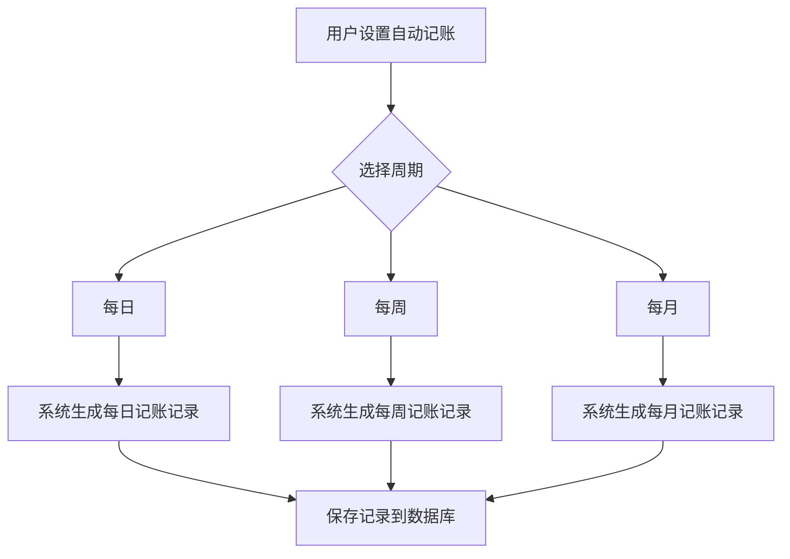

在日常生活中，有部分消费是固定金额、周期性的，比如每月的手机月租、水电费、房租等。为了更好地管理这些固定支出，那么在这篇文章中，我们就来实现这个自动记账的功能。

### 一、需求分析
用户在使用记账应用时，可以选择将某些支出设置为“自动记账”，并指定记账的周期（如每日、每周、每月等）、记账分类、金额等。系统会根据用户设置的周期，自动生成相应的记账记录，帮助用户更好地管理和跟踪这些固定支出。

我们先来画一下流程图：

这个流程图比较简单，但是也基本上涵盖了自动记账的核心逻辑。接下来，我们再细化一下每个步骤的具体实现细节。

###### 1.1 用户设置
首先，用户在自动记账模块中，添加自动记账规则，填写相关信息，包括：
- 规则名称
- 计入的账本
- 记账分类
- 金额
- 记录的币种
- 周期（每日、每周、每月等）
- 开始日期
- 结束日期

以上信息都确认后，用户点击"保存"按钮，系统将这些信息存储到数据库中，形成一条自动记账规则记录，这条记录将作为后续自动生成记账记录的依据。

###### 1.2 系统定时执行
系统需要有一个定时任务调度器，定期检查所有的自动记账规则。对于每一条规则，系统会根据当前日期和规则的执行周期，判断是否需要生成新的记账记录。如果需要生成，系统会根据规则中的信息，创建一条新的记账记录，并将其保存到数据库中。

首先，我们需要设计一个定时任务，定时任务会每天运行一次，检查所有的自动记账规则。如果当前日期符合某条规则的执行条件（例如，今天是每月的1号，而规则设置为每月记账），那么系统就会生成一条新的记账记录，并将执行记录保存到数据库中。

我们的执行规则如下：
- 如果是每天记录，并且上次执行时间小于今天，则执行记账
- 如果是周记录，并且上次执行时间小于本周一，则执行记账
- 如果是月记录，并且上次执行时间小于本月一号，则执行记账
- 如果是季度记录，并且上次执行时间小于本季度第一天，则执行记账
- 如果是年记录，并且上次执行时间小于今年一号，则执行记账

### 二、功能设计
具体功能需求已经分析完毕，接下来我们来设计具体的功能模块。

###### 2.1 表结构设计
我们需要设计两张表：开销规则表和定期支出规则执行记录表。以下是这两张表的实体设计：
```csharp
using SP.Common.Model;
using System.ComponentModel.DataAnnotations.Schema;
using System.ComponentModel.DataAnnotations;
namespace SP.FinanceService.Models.Entity;

/// <summary>
/// 定期支出规则执行记录
/// </summary>
[Table(name: "RecurringExpenseRuleExecutionRecord")]
public class RecurringExpenseRuleExecutionRecord : BaseModel
{
    /// <summary>
    /// 定期支出规则id
    /// </summary>
    [Required]
    [Column(TypeName = "bigint")]
    public long RecurringExpenseRuleExecutioId { get; set; }

    /// <summary>
    /// 是否成功
    /// </summary>
    [Required]
    [Column(TypeName = "tinyint")]
    public bool IsOK { get; set; } = true;
}

using SP.Common.Model;
using System.ComponentModel.DataAnnotations;
using System.ComponentModel.DataAnnotations.Schema;

namespace SP.FinanceService.Models.Entity;

/// <summary>
/// 规定开销规则
/// </summary>
public class RecurringExpenseRule: BaseModel
{
    /// <summary>
    /// 账本id
    /// </summary>
    [Required]
    [Column(TypeName = "bigint")]
    public long AccountBookId { get; set; }
    /// <summary>
    /// 标题
    /// </summary>
    [Required]
    [Column(TypeName = "nvarchar(20)")]
    public string Title { get; set; }
    /// <summary>
    /// 金额
    /// </summary>
    [Required]
    [Column(TypeName = "decimal(18,2)")]
    public decimal Amount { get; set; }
    /// <summary>
    /// 分类id
    /// </summary>
    [Required]
    [Column(TypeName = "bigint")]
    public long CategoryId { get; set; }
    /// <summary>
    /// 开始日期
    /// </summary>
    [Required]
    [Column(TypeName = "datetime")]
    public DateTime StartDate { get; set; }
    /// <summary>
    /// 结束日期
    /// </summary>
    [Required]
    [Column(TypeName = "datetime")]
    public DateTime EndDate { get; set; }
    /// <summary>
    /// 频率（单位：天）
    /// </summary>
    [Required]
    [Column(TypeName = "int")]
    public int FrequencyInDays { get; set; }
    /// <summary>
    /// 币种id
    /// </summary>
    [Required]
    [Column(TypeName = "bigint")]
    public long CurrencyId { get; set; }
}
```
前面的代码展示了我们如何设计这两张表的实体类，具体就不过多讲解了。接下来，我们需要实现自动记账的核心逻辑。

###### 2.2 接口设计
这里涉及到的接口不是很多，一共五个接口：**新增开销规则**、**编辑开销规则**、**删除开销规则**、**获取规定开销规则** 和 **分页查询**。以下是这些接口的定义：
```csharp
using Microsoft.AspNetCore.Mvc;
using SP.Common.Model;
using SP.FinanceService.Models.Request;
using SP.FinanceService.Models.Response;
using SP.FinanceService.Service;

namespace SP.FinanceService.Controllers;

/// <summary>
/// 规定开销规则接口
/// </summary>
[Route("api/recurring-expense-rule")]
[ApiController]
public class RecurringExpenseRuleController : ControllerBase
{

    /// <summary>
    /// 规定开销规则服务
    /// </summary>
    private readonly IRecurringExpenseRuleServer _recurringExpenseRuleServer;

    /// <summary>
    /// 构造函数
    /// </summary>
    /// <param name="recurringExpenseRuleServer"></param>
    public RecurringExpenseRuleController(IRecurringExpenseRuleServer recurringExpenseRuleServer)
    {
        _recurringExpenseRuleServer = recurringExpenseRuleServer;
    }

    /// <summary>
    /// 新增开销规则
    /// </summary>
    /// <param name="recurringExpenseRuleAdd">新增请求</param>
    /// <returns>是否成功</returns>
    [HttpPost]
    public  async Task<ActionResult<long>> AddRecurringExpenseRule([FromBody] RecurringExpenseRuleAddRequest recurringExpenseRuleAdd)
    {
        long id = await _recurringExpenseRuleServer.AddRecurringExpenseRule(recurringExpenseRuleAdd);
        return Ok(id);
    }

    /// <summary>
    /// 编辑开销规则
    /// </summary>
    /// <param name="recurringExpenseRuleEdit">修改请求</param>
    /// <returns></returns>
    [HttpPut]
    public async  Task<ActionResult<long>> EditRecurringExpenseRule([FromBody] RecurringExpenseRuleEditRequest recurringExpenseRuleEdit)
    {
        long id = await _recurringExpenseRuleServer.EditRecurringExpenseRule(recurringExpenseRuleEdit);
        return Ok(id);
    }

    /// <summary>
    /// 删除
    /// </summary>
    /// <param name="ids">删除的数据id</param>
    [HttpPost]
    public async Task<ActionResult<bool>> DeleteRecurringExpenseRule([FromBody] List<long> ids)
    {
        await _recurringExpenseRuleServer.DeleteRecurringExpenseRule(ids);
        return Ok(true);
    }

    /// <summary>
    /// 获取规定开销规则
    /// </summary>
    /// <param name="id">规定开销规则id</param>
    /// <returns>规定开销规则</returns>
    [HttpGet]
    public ActionResult<RecurringExpenseRuleResponse> GetRecurringExpenseRule([FromRoute] long id)
    {
        RecurringExpenseRuleResponse response = _recurringExpenseRuleServer.GetRecurringExpenseRule(id);
        return Ok(response);
    }

    /// <summary>
    /// 分页查询
    /// </summary>
    /// <param name="page">分页信息</param>
    /// <returns>规定开销规则列表</returns>
    [HttpPost("/page")]
    public ActionResult<PageResponse<RecurringExpenseRuleResponse>> GetRecurringExpenseRulePage([FromBody] RecurringExpenseRulePgRequest page)
    {
        PageResponse<RecurringExpenseRuleResponse> response = _recurringExpenseRuleServer.GetRecurringExpenseRulePage(page);
        return Ok(response);
    }
}
```
上述代码展示了我们如何设计这些接口，接下来我们来实现自动记账的核心逻辑，经过了这么多章节的文章，我们已经掌握了很多基础知识，因此这里的实现就不再赘述细节代码了，我们直接来看一下核心逻辑的实现思路。

>Tip：Response 和 Request 相关的代码这里就不展示了，主要是封装请求和响应参数的，具体代码查看项目即可。

###### 2.3 业务实现
业务实现主要分为两部分：**规则管理** 和 **执行记录**。规则管理负责处理自动记账规则的增删改查操作，而执行记录则用于追踪每条规则的执行历史。这两部分的实现相对简单，主要是对数据库的基本操作。在这一小节中，我们重点关注自动记账的核心逻辑实现，也就是定时任务如何检查规则并自动生成记账记录。

我们需要实现一个定时任务，这个定时任务每天运行一次，系统会遍历所有有效的自动记账规则，根据每条规则设定的频率（每日、每周、每月、每季度、每年）以及上次执行时间，判断是否需要在当前时间点生成新的记账记录。如果判断结果为需要执行，系统就会自动创建一条新的记账记录，并将本次执行的情况保存到执行记录表中，以便下次执行时进行比对。

首先来看定时任务类的整体结构。我们创建了一个 `AccountingWatcher` 类，它实现了 Quartz 框架的 `IJob` 接口，这使得它可以被调度器定期调用执行。在构造函数中，我们注入了三个核心服务：`IRecurringExpenseRuleServer` 用于管理自动记账规则，`IRecurringExpenseRuleRecordServer` 用于管理执行记录，`IAccountingServer` 用于创建实际的记账记录。这种依赖注入的方式使得代码的可测试性和可维护性都得到了保障。
```csharp
public class AccountingWatcher : IJob
{
    private readonly IRecurringExpenseRuleServer _recurringExpenseRuleServer;
    private readonly IRecurringExpenseRuleRecordServer _recurringExpenseRuleRecordServer;
    private readonly IAccountingServer _accountingServer;

    public AccountingWatcher(IRecurringExpenseRuleServer recurringExpenseRuleServer,
        IRecurringExpenseRuleRecordServer recurringExpenseRuleRecordServer, 
        IAccountingServer accountingServer)
    {
        _recurringExpenseRuleServer = recurringExpenseRuleServer;
        _recurringExpenseRuleRecordServer = recurringExpenseRuleRecordServer;
        _accountingServer = accountingServer;
    }
}
```

接下来看 `Execute` 方法的实现，这是整个定时任务的入口点。方法开始时，我们通过 `_recurringExpenseRuleServer.GetAllRecurringExpenseRules()` 获取系统中所有的自动记账规则。这个方法会返回一个规则列表，每个规则对象包含了规则的所有配置信息，包括频率、金额、分类、开始结束日期等。
```csharp
public async System.Threading.Tasks.Task Execute(IJobExecutionContext context)
{
    List<RecurringExpenseRuleResponse> recurringExpenseRules =
        await _recurringExpenseRuleServer.GetAllRecurringExpenseRules();
    
    List<long> deleteIds = new List<long>();
    // 后续处理逻辑...
}
```

获取到规则列表后，我们需要遍历每一条规则进行处理。在处理每条规则之前，首先要检查规则是否已经过期。我们通过比较规则的结束日期和当前时间来判断，如果 `recurringExpense.EndDate < DateTime.Now`，说明这条规则已经超过了有效期，应当被清理掉。我们将这些过期规则的ID收集到 `deleteIds` 列表中，以便后续统一删除。对于已过期的规则，我们使用 `continue` 语句跳过后续的执行逻辑，直接处理下一条规则。

```csharp
foreach (var recurringExpense in recurringExpenseRules)
{
    if (recurringExpense.EndDate < DateTime.Now)
    {
        deleteIds.Add(recurringExpense.Id);
        continue;
    }
    // 后续判断和执行逻辑...
}
await _recurringExpenseRuleServer.DeleteRecurringExpenseRule(deleteIds);
```
对于没有过期的规则，我们需要根据规则的频率类型和上次执行时间来判断是否需要执行。为了做出这个判断，我们首先通过 `_recurringExpenseRuleRecordServer.GetRecordById(recurringExpense.Id)` 查询该规则上次执行的记录。如果返回的 `record` 为 `null`，说明这条规则从未执行过，那么无论什么频率都应该立即执行。如果 `record` 不为 `null`，我们就需要根据不同的频率类型进行不同的时间比较。

对于每日频率的规则，判断逻辑相对简单。我们检查 `record` 是否为 `null`，或者上次执行时间的日期部分是否早于今天。这里使用了 `.Date` 属性来只比较日期部分，忽略时间部分。如果 `record.CreateDateTime.Date < DateTime.Now.Date` 为真，说明上次执行是在昨天或更早，那么今天就应该执行一次新的记账。
```csharp
RecurringExpenseRuleExecutionRecord record =
    _recurringExpenseRuleRecordServer.GetRecordById(recurringExpense.Id);

if (recurringExpense.Frequency == FrequencyEnum.Day)
{
    if (record == null || record.CreateDateTime.Date < DateTime.Now.Date)
    {
        await Account(recurringExpense);
        RecurringExpenseRuleExecutionRecord newRecord = new RecurringExpenseRuleExecutionRecord();
        newRecord.IsOK = true;
        newRecord.RecurringExpenseRuleExecutioId = recurringExpense.Id;
        newRecord.CreateDateTime = DateTime.Now;
        newRecord.CreateUserId = recurringExpense.CreateUserId;
        newRecord.Id = Snow.GetId();
        _recurringExpenseRuleRecordServer.Add(newRecord);
    }
    continue;
}
```
当条件满足时，我们调用 `Account` 方法来创建实际的记账记录。然后创建一个新的执行记录对象 `RecurringExpenseRuleExecutionRecord`，设置其各个属性：`IsOK` 标记为 `true` 表示执行成功，`RecurringExpenseRuleExecutioId` 关联到对应的规则ID，`CreateDateTime` 记录执行时间，`CreateUserId` 记录执行用户，`Id` 通过雪花算法生成唯一标识。最后通过 `_recurringExpenseRuleRecordServer.Add(newRecord)` 将执行记录保存到数据库。

对于每周频率的规则，判断逻辑稍微复杂一些。我们需要判断上次执行时间是否早于本周的周一。这里使用了一个辅助方法 `GetStartOfWeek(DateTime.Now)` 来计算本周周一的日期。如果 `record` 为 `null` 或者 `record.CreateDateTime < GetStartOfWeek(DateTime.Now)`，说明上次执行是在上周或更早，那么本周应该执行一次新的记账。执行和记录保存的逻辑与每日频率完全相同。
```csharp
if (recurringExpense.Frequency == FrequencyEnum.Week)
{
    if (record == null || record.CreateDateTime < GetStartOfWeek(DateTime.Now))
    {
        await Account(recurringExpense);
        RecurringExpenseRuleExecutionRecord newRecord = new RecurringExpenseRuleExecutionRecord();
        newRecord.IsOK = true;
        newRecord.RecurringExpenseRuleExecutioId = recurringExpense.Id;
        newRecord.CreateDateTime = DateTime.Now;
        newRecord.CreateUserId = recurringExpense.CreateUserId;
        newRecord.Id = Snow.GetId();
        _recurringExpenseRuleRecordServer.Add(newRecord);
    }
    continue;
}
```
`GetStartOfWeek` 方法的实现值得详细说明。这个方法接收一个日期参数，返回该日期所在周的周一日期。实现原理是先计算当前日期是周几，然后计算它与周一的差值。`date.DayOfWeek` 返回一个枚举值，表示星期几，其中周日是0，周一是1。表达式 `(7 + (date.DayOfWeek - DayOfWeek.Monday)) % 7` 计算出当前日期距离周一有多少天。之所以要加7再取模，是为了处理周日的情况，因为周日减周一会得到负数。最后通过 `date.AddDays(-1 * diff).Date` 将日期往前推算到周一，并使用 `.Date` 只保留日期部分。
```csharp
private DateTime GetStartOfWeek(DateTime date)
{
    int diff = (7 + (date.DayOfWeek - DayOfWeek.Monday)) % 7;
    return date.AddDays(-1 * diff).Date;
}
```
对于每月频率的规则，我们需要判断上次执行时间是否早于本月的第一天。这里使用 `new DateTime(DateTime.Now.Year, DateTime.Now.Month, 1)` 来构造本月一号的日期对象。如果 `record` 为 `null` 或者 `record.CreateDateTime.Date` 小于本月一号，说明上次执行是在上个月或更早，那么本月应该执行一次新的记账。
```csharp
if (recurringExpense.Frequency == FrequencyEnum.Month)
{
    if (record == null ||
        record.CreateDateTime.Date < new DateTime(DateTime.Now.Year, DateTime.Now.Month, 1))
    {
        await Account(recurringExpense);
        RecurringExpenseRuleExecutionRecord newRecord = new RecurringExpenseRuleExecutionRecord();
        newRecord.IsOK = true;
        newRecord.RecurringExpenseRuleExecutioId = recurringExpense.Id;
        newRecord.CreateDateTime = DateTime.Now;
        newRecord.CreateUserId = recurringExpense.CreateUserId;
        newRecord.Id = Snow.GetId();
        _recurringExpenseRuleRecordServer.Add(newRecord);
    }
    continue;
}
```
对于每季度频率的规则，判断逻辑更为复杂。我们需要计算当前日期所在季度的第一天。一年有四个季度，分别是1-3月、4-6月、7-9月、10-12月。表达式 `(DateTime.Now.Month - 1) / 3 * 3 + 1` 巧妙地计算出了当前季度第一个月的月份。首先 `DateTime.Now.Month - 1` 将月份转换为0-11的范围，然后除以3取整数部分得到季度索引（0、1、2、3），再乘以3得到该季度第一个月相对于1月的偏移量（0、3、6、9），最后加1得到实际月份（1、4、7、10）。结合当前年份，就构造出了本季度第一天的日期。
```csharp
if (recurringExpense.Frequency == FrequencyEnum.Quarter)
{
    if(record==null || record.CreateDateTime.Date < new DateTime(DateTime.Now.Year, (DateTime.Now.Month - 1) / 3 * 3 + 1, 1))
    {
        await Account(recurringExpense);
        RecurringExpenseRuleExecutionRecord newRecord = new RecurringExpenseRuleExecutionRecord();
        newRecord.IsOK = true;
        newRecord.RecurringExpenseRuleExecutioId = recurringExpense.Id;
        newRecord.CreateDateTime = DateTime.Now;
        newRecord.CreateUserId = recurringExpense.CreateUserId;
        newRecord.Id = Snow.GetId();
        _recurringExpenseRuleRecordServer.Add(newRecord);
    }
    continue;
}
```
对于每年频率的规则，判断最为简单直接。我们只需要判断上次执行时间是否早于今年的1月1日。使用 `new DateTime(DateTime.Now.Year, 1, 1)` 构造出今年元旦的日期，如果 `record` 为 `null` 或者 `record.CreateDateTime.Date` 小于这个日期，说明上次执行是在去年或更早，那么今年应该执行一次新的记账。
```csharp
if (recurringExpense.Frequency == FrequencyEnum.Year)
{
    if (record == null || record.CreateDateTime.Date < new DateTime(DateTime.Now.Year, 1, 1))
    {
        await Account(recurringExpense);
        RecurringExpenseRuleExecutionRecord newRecord = new RecurringExpenseRuleExecutionRecord();
        newRecord.IsOK = true;
        newRecord.RecurringExpenseRuleExecutioId = recurringExpense.Id;
        newRecord.CreateDateTime = DateTime.Now;
        newRecord.CreateUserId = recurringExpense.CreateUserId;
        newRecord.Id = Snow.GetId();
        _recurringExpenseRuleRecordServer.Add(newRecord);
    }
    continue;
}
```
最后来看 `Account` 方法的实现。这是实际创建记账记录的方法，它接收一个 `RecurringExpenseRuleResponse` 对象作为参数。方法内部首先获取规则关联的账本ID，然后创建一个 `AccountingAddRequest` 对象，将规则中的各项信息填充到这个请求对象中，包括账本ID、金额、币种ID、交易分类ID等。特别注意 `RecordDate` 被设置为 `DateTime.Now`，表示记账时间为当前时间。最后调用 `_accountingServer.Add` 方法来真正创建记账记录并保存到数据库。
```csharp
private async System.Threading.Tasks.Task Account(RecurringExpenseRuleResponse recurringExpense)
{
    long accountBookId = recurringExpense.AccountBookId;
    AccountingAddRequest accountingAdd = new AccountingAddRequest();
    accountingAdd.AccountBookId = accountBookId;
    accountingAdd.Amount = recurringExpense.Amount;
    accountingAdd.CurrencyId = recurringExpense.CurrencyId;
    accountingAdd.RecordDate = DateTime.Now;
    accountingAdd.TransactionCategoryId = recurringExpense.CategoryId;
    await _accountingServer.Add(accountB ookId, accountingAdd);
}
```
通过这样的设计和实现，我们的自动记账系统能够准确地根据用户设定的规则，在正确的时间点自动生成记账记录。系统每天运行一次定时任务，遍历所有有效规则，根据不同的频率类型进行时间比对，确保每条规则都能按照预期的周期执行。同时，执行记录的保存机制保证了系统能够准确追踪每条规则的执行历史，避免重复执行或遗漏执行的情况发生。整个实现逻辑清晰，代码结构合理，为用户提供了可靠的自动记账功能。

### 三、总结
通过本文的介绍，我们实现了一个自动记账的功能，帮助用户更好地管理和跟踪他们的固定支出。我们设计了相应的数据库表结构，定义了必要的接口，并实现了核心的业务逻辑。通过定时任务的方式，系统能够定期检查自动记账规则，并根据规则生成相应的记账记录。希望这篇文章能对你有所帮助，祝你编码愉快！